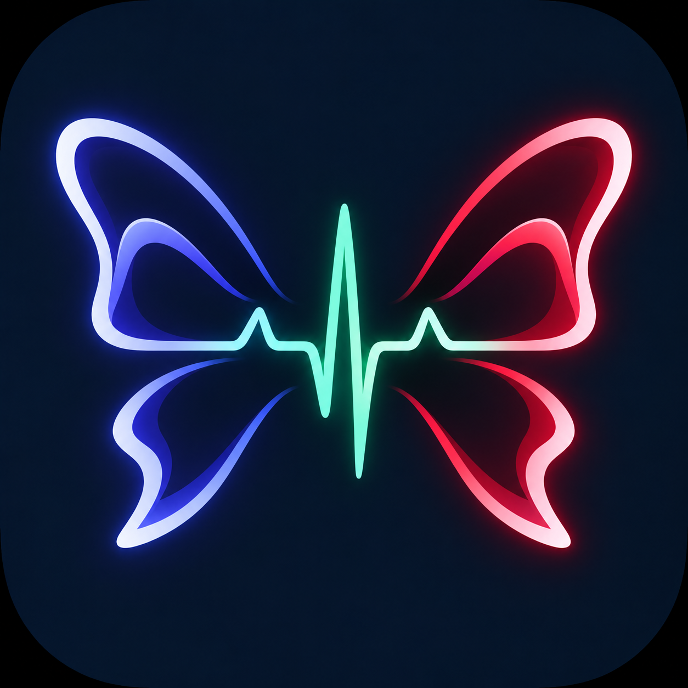
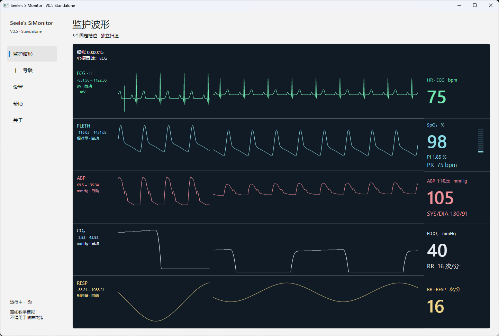
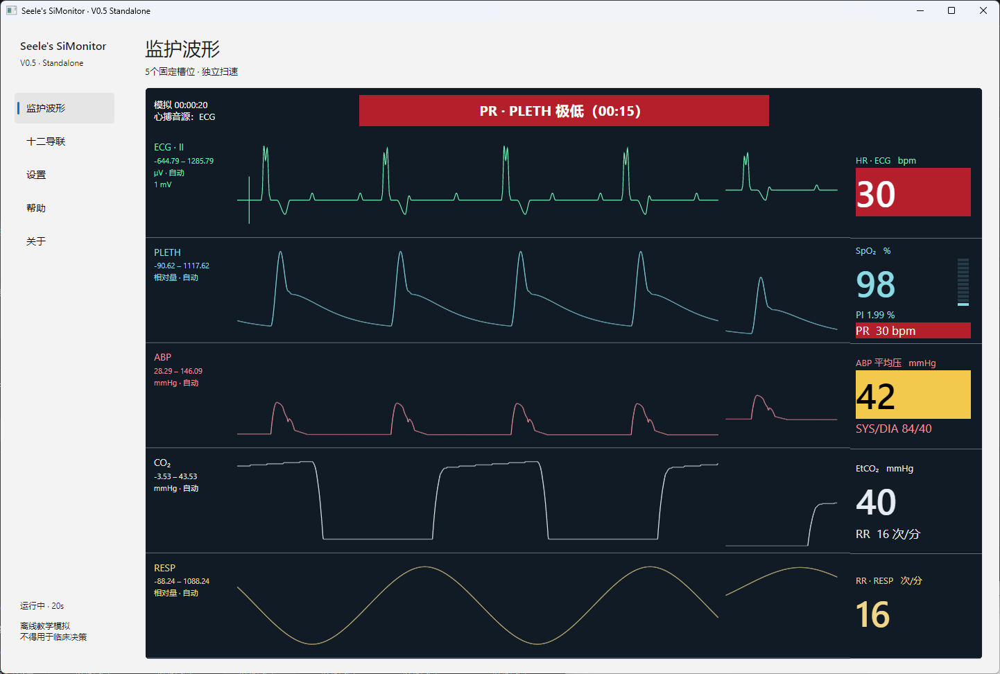
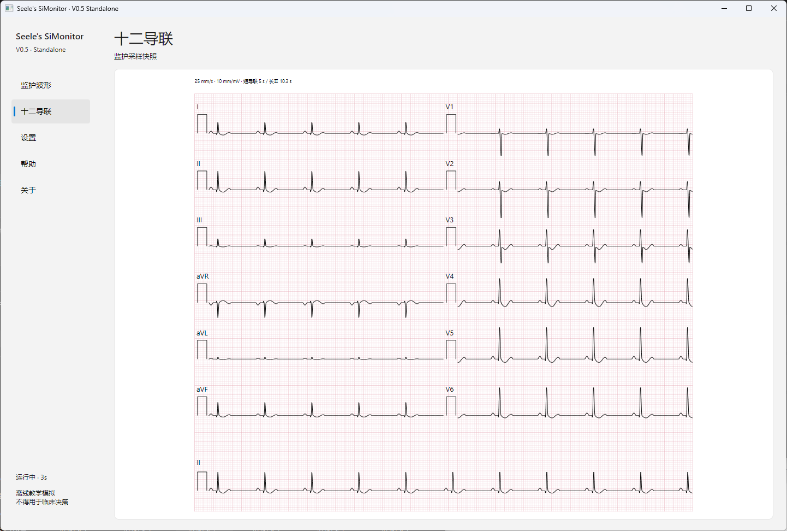
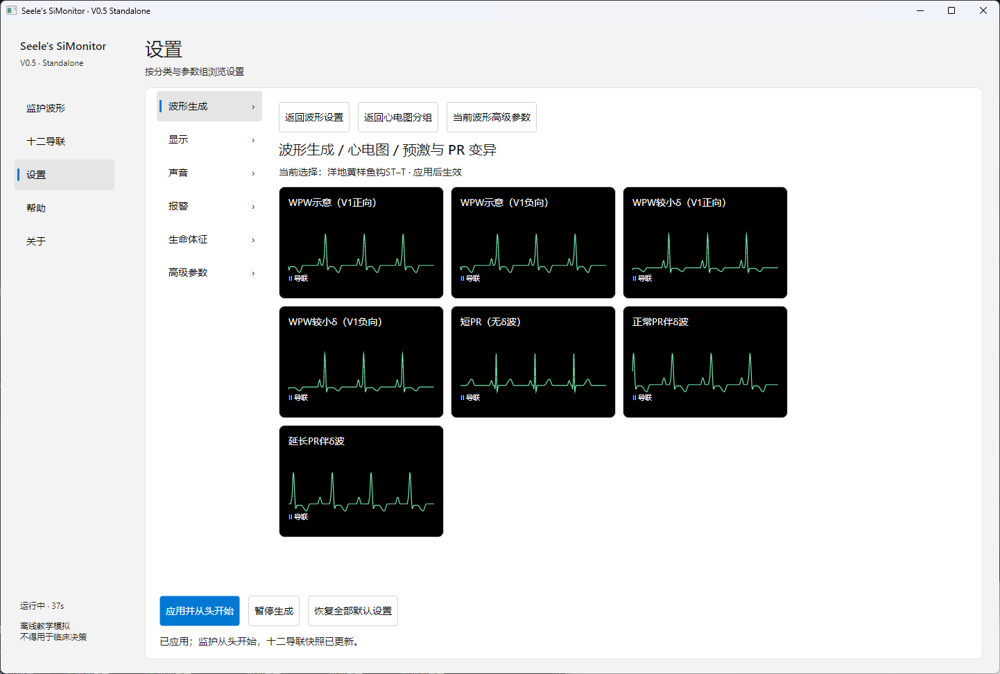

# Seele's SiMonitor



**简体中文** | [English](docs/en/README.md)

Seele's SiMonitor 是用于教学的心电图及其他监护波形模拟器。**本项目不是医疗器械，不用于临床监护、诊断或治疗。**

仓库包含 .NET 桌面应用、确定性仿真库、原生音频适配器、构建工具、可执行规格检查、锁定的依赖和许可证资料。

ECG 检测能力与皮肤集成边界见 [ECG 增强监测接口](docs/interfaces/alarms/ecg-monitoring.md)。

技术资料见 [文档导航](docs/README.md) 和 [英文摘要](docs/en/summary.md)。参与开发前请阅读 [贡献指南](CONTRIBUTING.md)。


## 运行截图

**主监护界面**



**低脉率报警**



**十二导联心电图**



**波形预设设置**



## 环境要求

- Python 3.11 或更新版本。
- 稳定版 .NET 10 SDK；具体版本与回退规则见 [`global.json`](global.json)。
- CMake 3.20 或更新版本，以及用于编译原生音频模块的 C 编译器。
- Windows 上还需要 Visual Studio C++ Build Tools 和 Windows SDK。

以下命令均从仓库根目录执行。Linux 和 macOS 使用 `python3`；Windows 端请将命令中的 `python3` 替换为 `py -3`。构建脚本会恢复锁定的依赖，并校验下载的原生源码的 SHA-256。

## 构建与运行

构建当前平台的开发版本：

```sh
python3 tools/build.py --jobs 32
```

该命令准备依赖、编译生产用原生音频库并构建 Release 配置的完整解决方案。构建结果位于 `src/Monitor.Desktop/bin/Release/net10.0/`。运行桌面应用：

```sh
dotnet run --project src/Monitor.Desktop --no-build --configuration Release
```

Windows 清理后，应先重新运行构建脚本以恢复原生音频 DLL。若使用默认 Debug 配置的 `dotnet run --project src/Monitor.Desktop/Monitor.Desktop.csproj`，先执行 `py -3 tools/build.py --configuration Debug`。仅重编译原生库后，再运行不带 `--no-build` 的 `dotnet run`，才会将新 DLL 复制到对应的应用输出目录；缺失 DLL 时启动检查会提示上述恢复命令。

也可以先准备依赖，再使用本地缓存构建：

```sh
python3 tools/fetch_dependencies.py
python3 tools/build.py --offline --jobs 32
```

生成本地产品候选版本：

```sh
python3 tools/build_release.py --jobs 32
```

产品输出位于 `artifacts/release/`。Windows 声音默认使用原生 WASAPI 音频库，Linux 通过系统 ALSA 库（也覆盖 PipeWire、PulseAudio）直接出声，不需要原生音频库；macOS 暂无声音输出。一个平台上的构建或检查不能代替另一平台设备的实际验证。

`artifacts/` 中的生成结果由构建脚本创建，且被 Git 忽略。项目的原生音频包装源码位于 `native/sim_audio_native/`；依赖脚本将固定版本的 `vendor/miniaudio.h` 下载到该目录，核对其 SHA-256 后才用于构建。审阅这份上游头文件前，先运行依赖准备命令。源码位置、输出布局及原生诊断方法见 [原生音频指南](native/sim_audio_native/README.md)。

## 验证

准备依赖后，可运行依赖清单检查、Release 构建及可执行规格检查：

```sh
python3 tools/fetch_dependencies.py
python3 tools/verify_dependency_ledger.py
dotnet build Monitor.slnx --no-restore --configuration Release
dotnet run --project tests/Monitor.Specs/Monitor.Specs.csproj --no-build --configuration Release
```

这里的 `--no-restore` 依赖第一步已完成的依赖准备。其他专项检查应按改动范围及相关模块文档执行；构建或规格检查通过不等于 Windows 实机、音频设备或发布验收通过。

## 清理本地生成内容

清除编译缓存、测试输出和 `artifacts/` 下的生成结果：

```sh
python3 tools/clean.py clean
```

进一步清除 `.cache/` 及依赖脚本下载的 `native/sim_audio_native/vendor/miniaudio.h`：

```sh
python3 tools/clean.py dirclean
```

两种清理方式都可加 `--dry-run` 预览删除范围，例如 `python3 tools/clean.py clean --dry-run`。**清理会删除整个 `artifacts/`，包括候选发布包和自行放入的文件**；执行前请将需要保留的产物移出该目录。

清理后如需重新合成当前选用的语音，运行：

```sh
python3 tools/fetch_dependencies.py --tts-only
python3 tools/fetch_dependencies.py --tts-only --check
python3 tools/generate_selected_therapy_voices.py --offline
```

`--tts-only` 自动恢复 FastSpeech2-A（AISHELL-3 SSB0534）、PWGAN 声码器、英文 E1（VITS LJS）、词典、来源说明及独立 CPU Python 环境，默认放在 `.cache/tts/`。需要 Python 3.11+ 和可用的 pip/venv；脚本不安装 Torch/CUDA。模型下载地址、大小上限及 SHA-256 见 [`eng/audio/tts-models.json`](eng/audio/tts-models.json)，直接 Python 依赖版本见 [`eng/audio/tts-requirements.txt`](eng/audio/tts-requirements.txt)。下载和解压均校验哈希，完成后删除临时压缩包；已有完整资源不会重复下载。

`--tts-cache-dir PATH` 可指定恢复位置；生成工具也需传入相同参数。`--check` 只校验，`--offline` 在资源缺失时报告错误。普通构建无需 TTS 模型；需要同时准备构建依赖和 TTS 时使用 `--tts`。默认不恢复 Qwen、Kokoro、CosyVoice 等历史候选，也不恢复旧 R1–R4 试听流程所依赖的全部缓存和中间产物。

重新合成覆盖中英文各 23 条固定提示，输出到 `artifacts/therapy-selected-resynthesis/`，可用 `--language zh-CN` 只生成中文。推理存在随机性，输出需重新听审，不保证与已确认 WAV 字节一致。生成工具不会覆盖仓库中已确认的语音；这些位于 `eng/audio/voices/` 的受版本控制资源也不会被上述清理命令删除。
脚本只处理仓库内生成内容，不卸载系统工具链，也不清理供其他项目共用的全局 NuGet 缓存。

## 许可证与归属

项目原创代码采用 AGPL-3.0-or-later，详见 [`LICENSE`](LICENSE) 和 [许可证范围说明](docs/legal/license-scope.md)。第三方代码及资源保留各自的许可证。依赖来源和哈希记录在 [`eng/dependencies.json`](eng/dependencies.json)，相关声明见 [`eng/licenses/`](eng/licenses/) 和 [Infirmary 来源声明](docs/legal/infirmary-source-notice.md)。

## Todo
- 正式图标设计（当前为临时图标）
- 生命体征逐项调整
- Generic 皮肤治疗与工具栏按键功能接入
- 事件驱动的生命征连续变化
- 独立教师端、学生端
- 教学与考试功能
