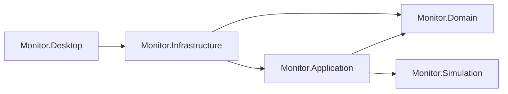

# 当前实现接口总览

本目录描述 `monitor-v1-cleanup` 当前源码中的接口：C# 模块边界、数据模型、二进制编解码、原生音频 ABI、本地文件格式和开发命令。接口行为以当前工作区实现为准，包括尚未提交的源码；上级工作区的需求合同另列为参考，不代表已经接入桌面产品。

## 阅读入口

| 接口范围 | 契约说明 | 公开声明索引 |
|---|---|---|
| 生理生成、确定性、采集、波形传输、归档、氧合 | [仿真与波形](simulation.md) | [Monitor.Simulation](api/simulation.md) |
| 测量、质量、报警通知、扫线、记录、12 导联与手工测量 | [测量与呈现](measurements-presentation.md) | [Monitor.Application](api/application.md)、[Monitor.Domain](api/domain.md)、[Monitor.Infrastructure](api/infrastructure.md) |
| 会话权威、治疗、评分、身份、断线续算与恢复 | [权威、身份与恢复](authority-identity-recovery.md) | [Domain](api/domain.md)、[Application](api/application.md)、[Infrastructure](api/infrastructure.md) |
| 声音输出、原生 ABI、偏好文件与存储 | [音频与持久化](audio-persistence.md) | [Monitor.Infrastructure](api/infrastructure.md) |
| 本地化端口、中英文资源、格式校验与翻译协作 | [本地化](localization.md) | [Monitor.Application](api/application.md)、[Monitor.Infrastructure](api/infrastructure.md) |
| 桌面装配、控件、命令行、构建及开发工具 | [桌面与命令行入口](desktop-tools.md) | [Monitor.Desktop](api/desktop.md) |

说明文档回答“怎样调用、什么时间／单位、失败后保留什么状态”。声明索引按源文件完整列出对程序集外可见的显式 `public` 声明，包含构造器、重载、属性、record 参数、枚举、端口和常量；方法实现、编译器合成成员及继承成员不重复展开。索引不是独立 SDK 或兼容性承诺。

未公开的桌面装配类只在入口文档说明其作用；测试内部助手、第三方头文件内部 API、生成波形表的每个采样值不属于应用集成契约。开发命令与原生导出即使不对应 C# `public` 类型，也在专题文档中列出。

ECG 增强事件、逐搏分类、起搏证据和 ST/QT 集成见 [ECG 增强监测](alarms/ecg-monitoring.md)。

## 工程与所有权

项目引用来自各项目的 `.csproj`；箭头表示编译依赖。

| 层 | 拥有的事实与接口 | 接入边界 |
|---|---|---|
| `Monitor.Simulation` | 确定性流、源时间、生理事件、波形采样、氧合、MWS1 编码与归档 | 无 UI／存储依赖；`Authoring` 负责可配置示例源，`Acquisition` 负责样本及块 |
| `Monitor.Domain` | 治疗、身份政策、ECG 评分、连续性与安全状态、呈现几何及准入 | 由调用方提供时间／状态；不创建平台窗口或数据库 |
| `Monitor.Application` | 会话串行权威、身份服务、恢复编排、测量聚合、呈现发布、本地预览会话 | 通过显式参数和端口联系平台；`LocalMonitorPreviewSession` 是本地预览运行时 |
| `Monitor.Infrastructure` | SQLite、负载保护、签名验签、wire codec、偏好、SVG／worker、PCM 和原生音频 | 持有文件、数据库、线程与设备资源；调用方负责生命周期 |
| `Monitor.Desktop` | Avalonia 控件、输入转换、设置、定时推进、资源装配 | UI 线程串行操作；默认打开本地监护界面 |

目前仓库没有 HTTP 路由表、REST/OpenAPI 服务、gRPC 服务或教师端／学生端 WebSocket 监听实现。`ConnectionHealth` 中的 `WebSocketClose` 是状态机输入原因；`RecoveryWireCodec` 和 `WaveformEnvelopeCodec` 是编解码器，不会自行建立网络连接。

## 常用接入路径

| 需求 | 首要入口 | 调用链 |
|---|---|---|
| 运行本地监护 | `LocalMonitorPreviewSession` | 作者配置 → 生成与采集 → `Advance` → 测量／可见样本 → UI／声音 |
| 直接使用仿真库 | `PhysiologyIllustrationSource`、`PhysiologyWaveformGroup` | 创建定义 → `AdvanceTo` → 多通道 wave envelope → 解码／归档／测量 |
| 根据真实样本更新读数 | `LiveWaveformMeasurements` | `Consume` 同一块 → `LiveMeasurementSnapshot` 和检测事件 → `MeasurementDisplay`／通知 |
| 改变运行中的参数 | `ScheduleSource`、`UpdateOxygenationVentilation` | 验证完整修改 → 返回生效源时间 → 在推进时生效；显示仍受采集和呈现缓冲影响 |
| 渲染扫线／条带 | `SweepFrameWorkPump`、`EcgStripWorkPump` | 不可变 checkpoint → worker 重建 → 请求身份检查 → display gate 发布 |
| 操作已捕获记录 | `CapturedRecordStudySession`、`CapturedRecordSvgPresentation`、`RecordStudyPresenter` | 绑定记录与视图身份 → 准入 → 渲染 → 当前 input session → 命中／拖动／提交 |
| 输出监护声音 | `AudioOutputLifecycle`、`SoundPreviewPlayback`、`MonitorAlarmPlayback` | 打开独占渲染会话 → 排队／泵送 PCM → 监测退役 → 停止并释放 |
| 身份和本地持久化 | `BootstrapIdentityService`、`InstitutionAuthenticationService`、`SqliteIdentityRepository` | 注入密码／时间／ID／保护端口 → 登录或原子初始化事务 |
| 处理断线及重新同步 | `ClientRecoverySession`、`ContinuitySignatureGate`、`RecoveryResyncPlanFactory` | 验签与绑定检查 → capsule／lease → shadow → 握手／重锁；传输层由宿主负责 |

## 时间、单位和有效性

| 约定 | 含义 |
|---|---|
| `SimTimeNs`、`SourceSimTimeNs` | 仿真／源时间，纳秒；不与 UI 时钟或 UTC 互换 |
| `AuthorityMonotonicNs`、安全时间、租约时间 | 权威安全流程的单调时间；具体来源由宿主提供 |
| `Presentation...Ns`、`FrontierNs` | 呈现推进或已可见数据边界；不能替代事件发生时间 |
| `UtcNow`、`DateTimeOffset` | 身份政策、审计等明确使用的墙钟；不推进生理生成 |
| `FromSimTimeNs` 至 `ToExclusiveSimTimeNs` | 左闭右开区间；点读取是否容许最后一个样本按对应类型规定 |
| `Microvolts`、`CentiMmHg`、`MilliBeatsPerMinute` | 分别为 μV、0.01 mmHg、0.001 bpm；保留字段倍率后再显示 |
| `SaturationMilliPercent`、`Permille`、`Millionths` | 0.001 个百分点、千分比、百万分比；`98000` 饱和度表示 98% |
| `Q32`、有理数分子／分母 | 定点或有理数；不要在权威计算中任意替换为浮点 |

`WaveformMeasurementStatus`、每个压力／呼气子读数状态、`ReasonCode` 和数值一起消费。无数据、预热、过期及不良信号不可用数值零代替。时间戳、epoch、sequence、revision、record/view ID 和取消令牌各有作用；仅数据形状一致不足以使过期结果继续有效。

一般参数／状态错误通过异常返回，领域动作可能返回 `DomainResult`，后台渲染和设备操作又各有发布状态或布尔结果。没有全局统一的 HTTP 状态码映射。以专题说明及相应异常的 `ReasonCode` 为准；不要依赖本地化界面文本做程序分支。

## 所有显式 C# 扩展端口

| 端口 | 定义及契约说明 | 当前接入情况 |
|---|---|---|
| `IArterialOxygenationSource` | [仿真](simulation.md)／[声明](api/simulation.md) | 源时间 SaO₂ 读取；存在采样与实时实现，固定目标由光学源构造参数提供 |
| `ITextLocalizer` | [本地化](localization.md)／[声明](api/application.md) | `CatalogTextLocalizer`，内置 `en`／`zh-CN`；产品桌面界面与帮助已全部接入 |
| `IPasswordHasher` | [身份](authority-identity-recovery.md)／[声明](api/application.md) | `Pbkdf2PasswordHasher` |
| `ICompromisedPasswordChecker` | 同上 | 注入泄露密码检查；宿主提供生产数据来源 |
| `IBootstrapIdentityRepository` | 同上 | `SqliteIdentityRepository` |
| `IAuthorityWallClock` | 同上 | 宿主注入身份／审计时间 |
| `IIdentityIdSource` | 同上 | 宿主注入 principal、audit、session ID 来源 |
| `IInstitutionAccountRepository` | 同上 | `SqliteIdentityRepository` |
| `IAuthenticationFailureTracker` | 同上 | 内存及 SQLite 实现 |
| `IContinuitySignatureVerifier` | [恢复](authority-identity-recovery.md)／[声明](api/application.md) | `Sm2ContinuitySignatureVerifier` |
| `IContinuityCapsulePayloadDecoder` | 同上 | 注入域 payload 解码；接口不等于完整跨域恢复实现 |
| `IContinuityShadowGenerator` | 同上 | 注入获准边界内的 shadow 生成 |
| `IIdentityPayloadProtector` | [身份](authority-identity-recovery.md)／[声明](api/infrastructure.md) | `AesGcmIdentityPayloadProtector` |
| `IPlatformKeyProtector` | 同上 | 平台保护由宿主注入；无内置生产 DPAPI 适配器 |
| `IAudioOutputDevice` | [音频](audio-persistence.md)／[声明](api/infrastructure.md) | 打开设备的生命周期端口 |
| `IAudioOutputFactory` | 同上 | `NativeAudioOutputFactory` |
| `IPumpedAudioOutput` | 同上 | `NativeAudioOutputFactory`，带 PCM 泵送和释放 |

## wire 和文件边界

| 格式 | 实现入口 | 使用说明 |
|---|---|---|
| MWS1 波形二进制 | `WaveformEnvelopeCodec` | 固定头、plane descriptor、raw16 样本、CRC32C、内容 SHA-256；[仿真文档](simulation.md) |
| 确定性 checkpoint | `DeterminismCheckpointCodec` | 固定算法／版本、规范序列化、恢复校验；不是通用对象快照 |
| 恢复控制 JSON | `RecoveryWireCodec` | 限定消息集合、字段／枚举／整数校验；[恢复文档](authority-identity-recovery.md) |
| 身份数据与备份 | `SqliteIdentityDatabase`、`AesGcmIdentityPayloadProtector`、`EncryptedSqliteBackupService` | 记录级负载保护、用途绑定、受保护备份；不等同整个 SQLite 文件加密 |
| `display-preferences.json` | `DisplayPreferenceStore` | 显示、报警、声音与作者配置；当前字段与兼容版本见[存储文档](audio-persistence.md) |
| `style-previews.bin` | `StylePreviewCatalog` | 桌面构建生成的内部有限样本目录；与当前程序一同分发 |
| 氧合实验 JSON | `OxygenationFixtureCommand`、`replay_oxygenation_transport.py` | `OxygenTransportReplayInput@1` → `OxygenTransportReplayResult@1`；[命令行文档](desktop-tools.md) |

## 接口维护

新增或更改公开类型、参数、默认值、单位、枚举、失败语义、文件版本、原生导出或 CLI 参数时，同步维护本目录的专题说明和对应声明索引。索引按 C# 语法树的有效 `public` 可见性整理，不用旧构建 DLL 推断尚未提交的接口；对位置 record、嵌套类型、重载及预处理分支也要核对。

修改 wire／持久化格式需明确版本与兼容处理；不要仅修改本页后假定外部合同同步升级。专题调研存放于 `docs/research/`，统一入口见[文档导航](../README.md)，接口页链接对应说明，避免复制临床研究或形成相互冲突的参数表。

起搏刺激、夺获与单次除颤电流源的调用边界见[仿真接口](simulation.md#起搏与除颤)。
