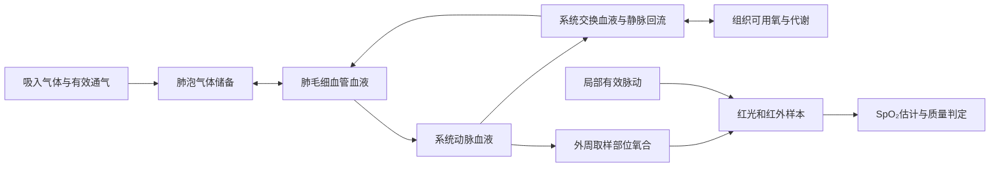

# 独立氧合下降模型调研

调研日期：2026-10-03。

## 建议与范围

建议建立独立的低阶氧输送分室模型，保存各处氧储备，以通气、血流和耗氧驱动演化，
再从动脉氧含量求出模型内的 SaO₂。外周光学样本仍由传感器源生成，SpO₂ 仍由
测量器计算；是否可报告继续取决于样本质量与脉动。

第一阶段优先验证有循环时的呼吸暂停、低通气、吸入氧浓度改变及恢复。
低流量、无流停搏和恢复循环需要额外的分室与验证，不能把有循环的呼吸暂停曲线
直接用于所有场景。内部氧合下降也不保证监护仪在失去脉动时还能显示下降数值。

| 路线 | 能解决的问题 | 局限与判断 |
| --- | --- | --- |
| 预设延迟后线性／指数降到目标 | 快速编排一段低血氧演示 | 下降速度由作者指定，不能解释肺内储氧、供氧、耗氧和血流；可保留为独立编排模式 |
| 少量分室的动态氧平衡 | 解释储备耗尽、下降与恢复、参数敏感性 | 需要物理量输入、初值和标定；推荐作为本项目的新模型 |
| 引入完整心肺生理引擎 | 更广的气体交换、循环和组织代谢耦合 | 依赖、状态恢复和确定性评估工作更大；本轮作为对照参考，不直接引入 |

这个选择是结合当前代码范围作出的工程判断，不代表已复现或验证任何论文模型。

## 文献证据及适用边界

1. [Farmery 与 Roe，1996，呼吸暂停时去饱和模型](https://doi.org/10.1093/bja/76.2.284)
   将非稳态肺泡氧通量、分流、循环时间及 Bohr 位移纳入计算，分析初始肺泡氧浓度、
   肺泡容积、耗氧、血容量和 Hb 的影响。本轮仅核对出版方摘要，未取得论文全文，
   因而不声称复现其方程或曲线。
2. [Hardman 等，2000，呼吸暂停低氧的生理建模研究](https://pubmed.ncbi.nlm.nih.gov/10702447/)
   显示肺内储备、耗氧、预充氧和气道条件均影响去饱和过程。其特定情景下的时间
   不能成为所有患者或本项目所有预设的统一下降时限。
3. [2023 年 OSA 氧输送模型](https://www.frontiersin.org/journals/physiology/articles/10.3389/fphys.2023.1198132/full)
   联合呼吸输入、血流、肺毛细血管交换与系统循环氧平衡，区分溶解氧和 Hb 结合氧。
   文中比较了模型输出与患者脉氧记录，也报告两者存在差异。它可参考于反复呼吸暂停，
   不能据此宣称已验证无流停搏。
4. [Severinghaus，1979，氧解离曲线计算](https://doi.org/10.1152/jappl.1979.46.3.599)
   提供标准氧分压与饱和度之间的近似关系，以及温度、pH 影响的计算讨论。
   解离曲线负责状态转换，本身不包含氧储备随时间的变化。
5. [Pulse 呼吸方法](https://pulse.kitware.com/_respiratory_methodology.html)与
   [组织方法](https://pulse.kitware.com/_tissue_methodology.html)将气体输送、肺泡与血液交换、
   组织交换及代谢分开处理。适合参考职责划分和守恒核验，不宜只取其某条输出曲线。
6. [Laviola 等，2020，气道恢复计算研究](https://doi.org/10.1016/j.bja.2020.01.004)
   的虚拟成人参数表可作为初始参数量级参考；其气道恢复研究还说明，呼吸暂停时的
   氧输入与气道开放、供氧有关，不能一律设为零。本文核对了作者机构提供的
   [论文全文](https://warwick.ac.uk/fac/sci/eng/staff/dgb/laviola_et_al-2020-brjanaesth.pdf)。

## 模型应保存什么

分为三个层次：

- 生理状态：肺泡氧、各血液分室氧含量、组织可用氧，及由此求出的 PaO₂／SaO₂。
- 传感器信号：取样部位氧合与局部脉动共同生成的红光／红外样本。
- 监护读数：SpO₂、PI、PR、质量状态和测量时间。读数不能反向充当生理真值。

建议的扩展结构如下；第一阶段可限制在稳定有效循环的适用范围内。



保留有限的肺毛细血管和组织储备，能避免在 Q=0 时用除法计算静脉氧、
或者把全身仍视为瞬时混匀。具体的分室数、容积与交换系数还需标定，
不应声称这幅结构图已经给出了完整的停搏生理模型。

## 数学骨架与必须补齐的闭合关系

以下平衡式是为本项目提出的简化设计，不是上述论文的逐式复现。
为便于检查单位，这里统一用：血容量 dL、血流 Q 为 dL/s、氧含量 C 为
mL O₂(STPD)/dL、氧储量 O 为 mL O₂(STPD)，氧通量为 mL O₂(STPD)/s。
实现时可以改用整数微升，但必须明确气体体积的基准状态；不能直接把 STPD
耗氧量与 BTPS 肺容积相减。

### 从氧含量到饱和度

先维护氧的量，再进行状态转换。一个可供首版固定温度、固定 pH 情形使用的关系为：

```text
S(P) = (P³ + 150P) / (P³ + 150P + 23400)
C(P) = 1.34 × Hb × S(P) + 0.0031 × P
```

其中 P 用 mmHg，Hb 用 g/dL，S 为 0–1 的分数。第一式来自上述 Severinghaus
标准曲线近似；第二式的 Hb 结合氧与溶解氧形式及按血流混合氧含量的做法，可参见
[2020 年肺灌注建模研究的方法](https://www.nature.com/articles/s41467-020-18672-6)。
应混合氧含量，再反求 P 与 S，不直接平均两个血液流的饱和度百分比。

按第一式计算，P 为 100、60、40 mmHg 时 S 约为 97.7%、90.6%、74.9%。
这是静态曲线的数学示例，不是停搏或呼吸暂停的时间预测。
它解释了为何氧储备下降并不意味着饱和度百分比匀速下降。
首版若固定 pH 和温度，必须明确不包含高碳酸血症导致的曲线位移；
不要把标准曲线外推当成对长时间呼吸暂停、低温或酸中毒的准确预测。

### 动态守恒

设 f 为右向左分流比例，q=(1-f)Q；Cpc、Ca、Cv 分别为肺毛细血管、
动脉和静脉／系统交换血液氧含量，Vpc、Va、Vv 为对应固定血容量。
JL 为肺泡向肺毛细血管的净氧通量，JT 为系统血液向组织的净氧通量，
M 为实际有氧耗氧，I、E 为气道进入和离开的氧通量。

```text
dOL/dt       = I - E - JL
Vpc dCpc/dt  = q(Cv - Cpc) + JL
Va dCa/dt    = q Cpc + f Q Cv - Q Ca
Vv dCv/dt    = Q(Ca - Cv) - JT
dOT/dt       = JT - M
```

各式相加应严格消去内部交换，只剩：

```text
d(OL + Vpc Cpc + Va Ca + Vv Cv + OT)/dt = I - E - M
```

这提供了一个比“曲线看起来像下降”更强的核验条件。但它仍需以下闭合关系，
未补齐前不能作为可运行或已标定模型交付：

- 肺泡气体组成、体积和压力：选择一致的 O₂／CO₂／惰性气体收支，或明确限制
  适用范围的近似。只给 O₂ 分量写守恒，不会自动得到完整的肺气体守恒。
  肺泡气体方程可用于适用条件下的稳态核对，不能替代动态储备；现有 EtCO₂
  示意平台也不能直接当作 PaCO₂。
- 气道输入输出：由呼吸周期内的有效流量、死腔、吸入氧和气道条件决定。
  仅使用 `RR × 潮气量` 的长期均值会丢失暂停与呼吸恢复的时序。
  气道关闭时 I/E 与开放气道供氧时必须分开；无呼吸运动不必然等于无气体输入。
- 交换：可以研究压差驱动的 JL、JT，但有效交换系数、组织氧储备到组织氧分压
  的映射及各分室容积都需要来源或显式作者假设，不能随意套用临床扩散常数。
- 耗氧：区分代谢需求与实际耗氧。储氧不足时实际耗氧受限，并记录未满足需求；
  不能继续扣成负数后仅把显示值截到零，也不能直接据此推断组织损伤时间。
- 初始条件：相同正常输入应能维持稳态；预充氧应改变储备初值与组成，
  不只把一个初始 SpO₂ 数值设成 100%。

### 无流边界

在上述简化设计中，Q=0 后血流输送项为零，局部 JL、JT 仍可在有限储备间交换。
动脉分室没有被假定为直接代谢场所，其氧含量不会仅因“停搏”就被强制统一下调。
组织储备可继续消耗，肺毛细血管局部气体交换可趋于平衡。
这些是该分室结构的推论，不能当作真实人体各部位的定量停搏曲线。

恢复 Q 时，分室内容经输送重新影响动脉状态；不应直接重置为停搏前饱和度。
无论内部状态如何，外周没有可用脉动时，监护读数仍保持不可用。

## 参数依据与首轮实验范围

Laviola 等的成人虚拟队列提供以下量级，适用于其研究人群，不是全人群合法范围。
这里选择的候选值只用于首轮原型敏感性实验，尚不是产品默认值。
后续产品已确定：用户没有单独指定的生理基线参数采用同性别、同年龄段参考模型的
0 SD 中心位置；统计定义、体格条件与覆盖规则见
[患者参数默认规则](oxygenation-prototype.md#后续患者参数的默认规则)。现已完成
[首版成人来源、计算及教师耗氧倍增器](oxygenation-defaults.md)，下表仍记录原始研究候选值。

| 参数 | 该研究使用的范围 | 本项目原型候选 |
| --- | --- | --- |
| 体重 | 65–75 kg | 70 kg |
| 潮气量 | 6–7 mL/kg | 450 mL |
| FRC | 2.1–2.3 L | 2.2 L |
| 耗氧需求 | 3.3–3.7 mL/min/kg | 250 mL/min，单位换算需统一 |
| Hb | 120–180 g/L | 150 g/L，即 15 g/dL |
| 解剖死腔 | 100–200 mL | 150 mL |
| 分流 | 1–3% | 2% |
| RQ | 0.7–0.9 | 0.8，仅在纳入 CO₂ 收支时使用 |

来源为上述 [2020 论文 Table 1](https://warwick.ac.uk/fac/sci/eng/staff/dgb/laviola_et_al-2020-brjanaesth.pdf)。
该研究呼吸频率为 10–14 次/分；仓库当前默认呼吸周期 3.75 s，即 16 次/分。
若保留仓库默认频率，必须重新求初始稳态，不能声称整套参数直接复现了论文队列。
后续原型已显式选择 Q 和有效血液分室容积，并单独验证血容量及分配比例的敏感性；
见[原型参数说明](oxygenation-prototype.md#血容量与患者资料)。组织储氧容量和有效交换
系数仍未选定，第一阶段通过瞬时肺端平衡和静脉合并耗氧约简，不用于无流情景。

不预设统一的“停呼吸 N 秒后降到 85%”。验证时必须连同初始气体组成、
通气、气道状态、储备、耗氧与 Q 一起记录。
