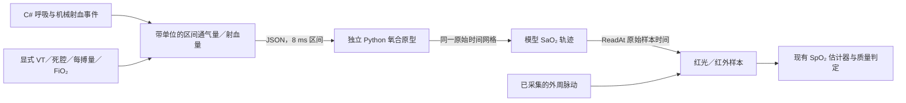

# 氧合第二步：物理输入与原始采样时间

日期：2026-10-03。已接通 C# 通气／血流物理量接口、原型回放桥和光学源的原始时间查询。
第二步保留**离线求解、运行时读取轨迹**用于交叉验证；现已另接入 C# decimal
进程内实时求解器，见下方[桌面实时接入](#桌面实时接入)。桌面默认场景不自动启用新模式。

当前通道语义与模型接入范围见[桌面实时接入](#桌面实时接入)。
物理输入可驱动传感器模型，不能直接把饱和度百分比或潮气量填入原来的 PLETH／RESP 通道。



## 物理输入契约

[PhysiologyTransportSource](../src/Monitor.Simulation/Physiology/PhysiologyTransportSource.cs)
是不可变、无推进游标的区间积分源。`Integrate(fromSimTimeNs, toExclusiveSimTimeNs)`
使用左闭右开的原始仿真时间区间，不依赖界面帧率、处理时间或显示延迟。

| 输入／输出 | 单位及含义 |
| --- | --- |
| `TidalVolumeMicrolitersBtps` | 参考潮气量，μL(BTPS)；由调用者显式设定 |
| `DeadSpaceMicrolitersBtps` | 死腔量，μL(BTPS) |
| `InspiredOxygenMillionths` | FiO₂ 的百万分数，210000 表示 21% |
| `AirwayOpen` | 独立气道条件；胸部运动不自动确定是否开放 |
| `ReferenceStrokeVolumeMicroliters` | 参考有效每搏量，μL 血液；不是血容量或 PI |
| `EjectionDurationNs` | 单次有效射血的有限持续时间，ns |
| `DeliveredVolumeNanolitersBtps` | 区间内实际送达的潮气体积，nL(BTPS) |
| `AlveolarVentilationNanolitersBtps` | 区间有效肺泡洗出体积，nL(BTPS)；不是肺内储量 |
| `EffectiveBloodVolumeNanoliters` | 区间累计射血量，nL 血液；除以区间时长才得到流量 |

参考 VT 赋予呼吸深度序列明确物理尺度，再逐呼吸扣除死腔。
吸气流量只在 `InspirationDurationNs − InspiratoryPauseNs` 时段分配，吸气暂停不送气。
`Absent`、`EffortOnly` 和深度为零的槽位均不送气；恢复后沿原来的呼吸时钟继续。
闭气道无送气；开放气道且零主动通气是否仍有被动氧输入，由氧合求解器处理。
这里沿用首步原型的有效混合气洗出近似，不是新的肺力学或死腔逐段输送模型。

血流由真正的 `VentricularMechanical` 源事件驱动。源共享原来的漏搏、房室传导、
早搏、房颤及其他节律时序，不从 ECG 心率或检测到的 PR 反推。
`CreateTransport` 工厂选择与示意源一致的每搏响应规则，参考每搏量仍需显式输入。
相对充盈／早搏强度乘以该参考量是**作者指定的物理标度**，不是患者校准结果。

每次射血只在有限持续时间内送血，完整积分等于缩放后的每搏量。
没有新射血时不添加长期平滑尾流；搏间零流量本身不作为停搏判定。
区间体积使用整数 nL 和宽整数前缀差，任意切分的体积之和与一次查询完全相等。
模型版本、物理参数和生理计划可通过 `CaptureState` 保存，并在恢复时重新验证。
单次查询最多 60 s、4096 个候选事件，超预算或取消时拒绝，不扫描起点以来全部历史。

显示幅度、极性、压力波形增益不参与物理量计算。例如 VT=450 mL、VD=150 mL 时，
一次有效呼吸提供 300 mL 的肺泡洗出体积；这与胸阻抗显示为 500 或 1000 counts 无关。
示例使用的 VT、每搏量等仍是研究基准，不自动标为患者同组的 0 SD。
后续自动默认继续遵守[已确定的患者默认规则](oxygenation-prototype.md#后续患者参数的默认规则)。

## 氧合与光学采样时间

[IArterialOxygenationSource](../src/Monitor.Simulation/Physiology/ArterialOxygenationSource.cs)
提供 `ReadAt(sourceSimTimeNs)`，返回带同一时间戳的模型 SaO₂。
实现必须是纯读取：提供该时刻的状态，或明确拒绝缺失历史；不能返回“最新值”代替。

`SampledArterialOxygenation` 是本阶段的具体适配器：

- 复制并持有规则网格的轨迹，支持任意顺序查询与检查点恢复。
- 明确采用整数、四舍六入五成双的线性插值；不外推首尾值。
- 内部接受 0–100% 生理饱和度，与仪器当前报告范围分离。
- 样本数和步长都有上界，构造前完整验证配置、数值与时间溢出。

[光学源](../src/Monitor.Simulation/Authoring/PulseOximeterIllustrationSource.cs)
按每个样本的 `block.StartSimTimeNs + i × 8 ms` 查询；即使数据块在约两秒后才到达，
也不使用当时的仿真前沿。血液输送所带来的生理变化应已经包含在氧合输出中；
此接口不再次叠加采集延迟，也不擅自将既有 Pleth 脉搏传播延迟当作血氧输送延迟。

氧合轨迹只改变红光／红外比值，SpO₂ 仍由现有估计器从这两个通道计算。
缺乏有效外周脉动时，质量门限保持原有行为，模型 SaO₂ 不直接冒充可测 SpO₂。
固定目标／种子波动和生理氧合源是互斥模式，不能在生理状态上再叠加预设波动。

[本地预览会话](../src/Monitor.Application/Presentation/LocalMonitorPreviewSession.cs)
已提供可选的 `oxygenation` 入口，要求启用测量；不改变现有调用者的默认模式。
每个最多 50 ms 的推进块先完成氧合历史查询和光学转换，再发布采集状态。
缺失历史、返回时间不符或超出光学范围时，该推进块可在补齐输入后重试。
较长 `Advance` 中已经完成的前序块保留；读取测量或暂停预览不会推进氧合状态。

第二步完成时光学示意源仅支持 75–100%。该限制已在
[第三步：深低数值报告与报警验证](oxygenation-reporting.md)中解除：当前支持 0–100%，
深低值继续经过光学测量并显示数值，信号质量门限保持独立。

## 可重现的 C# → Python → 光学测量回放

新增[回放工具](../tools/replay_oxygenation_transport.py)直接消费 C# 输出的有效通气量和
射血量。8 ms 内以区间平均流量推进原型，肺气量转换为 STPD，血液体积不做气体换算；
死腔已在输入侧扣除，不再重复扣减。初值取解析平均通气／血流稳态，不做周期预热。

这是新的脉动输入实验，不能视为首步恒定 Q 曲线的逐点复现。回放桥目前只接纳
规则、持续有效循环的成人例子；低／无流停搏与复杂节律的物理输入接口虽可生成，
仍不因此获得生理求解有效性声明。参考平均 Q 来自首个完整心动周期的实际射血量。

在仓库根目录，按 README 构建后执行：

```sh
dotnet run --project tests/Monitor.Specs/Monitor.Specs.csproj --no-build --configuration Release -- --oxygen-transport-fixture artifacts/oxygenation-transport/input.json
python3 tools/replay_oxygenation_transport.py artifacts/oxygenation-transport/input.json --output artifacts/oxygenation-transport/result.json
dotnet run --project tests/Monitor.Specs/Monitor.Specs.csproj --no-build --configuration Release -- --oxygenation-replay-check artifacts/oxygenation-transport/result.json
```

示例为正常通气 30 s、开放气道呼吸暂停 30 s、恢复通气 60 s。
输入共有 15000 个区间，输出包含初值在内的 15001 个同时间网格 SaO₂ 样本。
结果携带物理计划、有效参数、参数配置和输入／求解源码 SHA-256。
C# 回放检查会核对物理计划和时间网格，再经过实际的采集、光学转换和 SpO₂ 估计。

本轮结果：模型最低 SaO₂ 为 94.499%；测得 SpO₂ 基线为 97.865%、最低 94.607%、
末次 97.394%。氧收支最大残差约 4.44e-10 mL(STPD)。模型轨迹和测量最低值不同，
因为后者经过脉动取样、量化和估计窗口；这些数值仅为该实验的接线与数值核验结果。

## 核验与后续边界

新增 C# 规格覆盖任意区间切分、死腔、气道、呼吸暂停与恢复、射血停止与恢复、
显示增益独立性、远期有界查询、恢复、预算／取消、历史缺失、深低值拒绝、
逐样本原始时间及不同预览推进粒度。Python 检查覆盖换算、时间连续性、流量覆盖、
输入原子验证、适用范围和导入无副作用。
扩展流量输入后，原有 32 个原型情景的 CSV 数值逐字节保持一致。
本轮 Release 完整构建、1131 项 C# 规格、21 项 Python 检查以及 C# 风格／排版、
SPDX 和差异空白检查通过；上述跨语言回放也已实际执行通过。

第二步之后已补齐进程内氧合求解、预览会话状态所有权、通气变更和有界历史，
深低数值报告已在第三步接通。患者参考默认数据和完整报警状态机仍需后续处理。
源内部 SaO₂ 不直接接到仪器报警，报警持续消费光学测量结果。


## 桌面实时接入

模型版本 `OxygenTransportDecimal@2`（在 @1 基础上新增独立耗氧倍增器）。`OxygenReservoirModel` 移植原型的肺泡／动脉／
静脉氧储备和氧收支账本，采用 decimal、固定 8 ms RK4 和 48 次二分反演。
`RealtimeOxygenationSource` 显式推进；`ReadAt` 只读，保留最近 1024 个采样点
（8.184 s），覆盖 2 s 采集延迟及分块余量。超出历史或未来时间直接拒绝，不借用最新值。

每个预览块先在独立副本上完成求解、波形生成及光学历史查询，成功后发布。
模型每步使用同一场景的 `PhysiologyTransportSource`，气量、有效肺泡通气和实际射血量
来自呼吸及机械事件；显示增益、阻抗 RESP 幅值和 ECG 心率读数不用于反推物理量。
`LocalMonitorPreviewSession` 持有氧储备，实时路径没有 Python 子进程或轨迹文件依赖。
暂停期间读取数值不推进模型。

桌面核验入口：

1. 设置 → 生命体征 → 指脉氧：启用双波长指脉氧教学源，并勾选“使用实时氧合模型”。
2. 按[成人基线说明](oxygenation-defaults.md)填写患者资料或逐项指定基线。
   保持 VT 450 mL、VD 150 mL、FiO₂ 21%、气道开放，点击“应用并从头开始”；
   需要核验报警时，在报警设置中启用 SpO₂ 下限提示。
3. 运行约 30 s 后，将 VT 改为 0，点击“更新通气／耗氧，保留当前氧储备”观察下降，
   再恢复 VT 450 mL 并使用同一按钮观察恢复。旧基线约 150 s 停通气可观察深低值，
   恢复约 120 s 可回升；新基线的时间取决于患者参数及教师耗氧倍增器。

实时更新 VT、VD、FiO₂、气道状态及耗氧倍增器时，氧储备、时钟及测量窗口不重置。变更在当前仿真
时刻之后的第一个 8 ms 网格边界生效；同一边界的多次修改以最后一次有效输入为准。
边界以前的样本不重算。非法输入不会改变当前运行。
既有呼吸频率、吸气比例及呼吸模板决定通气的时序；修改这些场景设置仍通过整体应用，
会重新开始。新按钮只更新本次运行，不隐式保存其余未应用的设置草稿。

新建场景从所选基线的有通气参考氧储备开始，再按当前通气和耗氧倍增器演化，所以
可以直接以 VT=0 或闭气道开始。新建设置默认按年龄、性别、身高、体重解析血容量、
FRC、Hb 和基础耗氧，来源及范围见[成人基线](oxygenation-defaults.md)。分流 2%、
参考每搏量 66.667 mL 等仍是作者参数。旧偏好和回归实验保留血容量 4823.7546875 mL、
FRC 2200 mL、Hb 15 g/dL、基础耗氧 250 mL(STPD)/min，这些固定值不是 0 SD。
UI 通气范围为 VT 0–1500 mL、VD 0–500 mL、FiO₂ 10–100%。
VT 与吸气时程还须满足每个 8 ms 区间送气不超过 100 mL；超出原型流量范围时，
在接受设置前拒绝并提示减小 VT 或延长吸气时程。

模型 SaO₂ 继续经过红光／红外样本和四秒测量窗口形成 SpO₂；低于 70% 且有效仍显示
数值。机械停止后仍必须通过脉动质量门槛，模型中的残留氧量不等于可显示的监护读数。
RESP 是胸廓阻抗相对信号、PLETH 是外周脉动相对信号；CO₂ 仍是独立示意生成器，
本次未把模型气体池接入 EtCO₂。没有无流病人生理轨迹验证、酸碱／组织模型或临床标定。
参数越界、库存越界等计算错误使预览暂停并报告，不通过裁负值伪造守恒。

实时状态仅在内存中持有，支持块级试算副本；本次没有实现产品权威状态检查点、跨进程
继续运行或治疗事件日志。偏好只保存模型选择和输入，不保存氧储备或测量历史。
新增可选偏好字段保留旧文件兼容：没有该字段时仍恢复原有固定目标模式。

跨语言验收入口（先按上文生成 300 s 深低血氧 Python 轨迹）：

```sh
dotnet run --project tests/Monitor.Specs/Monitor.Specs.csproj --no-build --configuration Release -- \
  --oxygenation-realtime-check artifacts/oxygenation-deep/result.json
```

该命令逐点比较 37501 个源时间值，然后通过实时预览与红光／红外测量再次检查下降、
深低数值与报警恢复；Python 输出仅作校验参照，不驱动实时会话。

原固定基线、1 倍耗氧的回归结果：最大 SaO₂ 差异 0.001 个百分点，最大氧收支残差
2.823e-22 mL(STPD)。初始参考平衡采用 5 L/min，而 Python 逐搏夹具由整数每搏量
得到 5.000025 L/min；两者存在极小初值差异，不要求舍入后的每个数值完全相同。
实时测得 SpO₂ 基线 97.734%、最低 42.667%、末次 96.125%；336 次有效读数低于
70%，预热后没有无效读数，下降经过 Warning／Critical，恢复后清除低血氧提示。
结果保存在 `artifacts/oxygenation-deep/realtime-check.json`（可再生成，不入库）。
